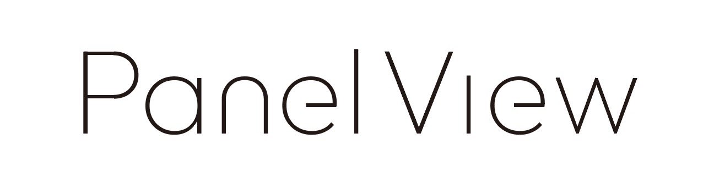

# PanelView



## 概要

Bve Trainsim の運転台を外部のウィンドウに出力するアプリケーションです。

ATSプラグイン形式となっており、Bve本体から呼び出して貰うことで機能の提供を行います。

## 開発環境

* cmake version 3.31.1
* Microsoft Visual Studio 2022 Community Edition
* Microsoft DirectX 9 SDK (June 2010) 
* Windows SDK 10.0.26100.0

## ビルド方法

* Windows 
  1. 上記に準ずる開発環境を導入する。
  1. `./Build.bat` を実行する。
  1. `build.x64`, `build.x86` の2つができあがるので、ビルドを行いたい方のソリューションファイルを IDE で開きビルドする。

## ビルド済みの成果物について

Release ページからダウンロード可能です。

## プラグインの導入

### 前提

* [DirectX 9ランタイム](https://www.microsoft.com/ja-jp/download/details.aspx?id=35)
* [Microsoft Visual C++ 再頒布可能パッケージ](https://learn.microsoft.com/ja-jp/cpp/windows/latest-supported-vc-redist?view=msvc-170#latest-microsoft-visual-c-redistributable-version)
* [Windows環境: 対応バージョン](https://developer.microsoft.com/ja-jp/windows/downloads/windows-sdk/#supported-operating-systems)

### 手順

1. 前提を導入し条件を満たす。
1. 車両アドオンへ本プラグイン `PanelView.dll` と `panelview.toml` ファイルを配置する。
1. `panelview.toml` を適切な値で設定し保存する。
1. 車両アドオン中の「車両ファイル」の `Ats32`, `Ats64` セクションへ本プラグインへのパスを記述する。
1. 路線ファイルから車両アドオンを実行する。

## プラグインの頒布

本製品および依存しているライブラリのライセンスの条件に従い、ライセンス表記を掲出する必要があります。

必要に応じて README 等に記載いただくか、本ドキュメントと [LICENSE.md](./LICENSE.md) を同梱し配布してください。

## 設定ファイルについて

### panelview.toml

[TOML](https://ja.wikibooks.org/wiki/Toml)形式で記述します。

最低限以下の情報が必須です。

```toml
Version = "PanelViewSettings 1.0"  # バージョン情報。必須。

BaseDirectory = ""                 # 予約。このまま触らない。

# 運転台パネルウィンドウ1枚目。2枚目の場合は [Window.2] となる。
[Window.1] 
PanelFile = "../Panel/Panel.txt"            # 表示したい運転台パネルファイルへのパス
SettingFile = "panelSettings.toml"          # 運転台パネルウィンドウの状態を保存するファイルへのパス。
                                            # 存在しない場合は自動で作成します。
BackgroundColorRgb = 0xFFFFFF               # 運転台パネルの背景色 (R, G, B)
```

## この先に対応を考えていること

[別紙参照](./TODO.md)

## 使用しているOSSのライセンス表記

### toml11

```text
The MIT License (MIT)

Copyright (c) 2017 Toru Niina

Permission is hereby granted, free of charge, to any person obtaining a copy
of this software and associated documentation files (the "Software"), to deal
in the Software without restriction, including without limitation the rights
to use, copy, modify, merge, publish, distribute, sublicense, and/or sell
copies of the Software, and to permit persons to whom the Software is
furnished to do so, subject to the following conditions:

The above copyright notice and this permission notice shall be included in
all copies or substantial portions of the Software.

THE SOFTWARE IS PROVIDED "AS IS", WITHOUT WARRANTY OF ANY KIND, EXPRESS OR
IMPLIED, INCLUDING BUT NOT LIMITED TO THE WARRANTIES OF MERCHANTABILITY,
FITNESS FOR A PARTICULAR PURPOSE AND NONINFRINGEMENT. IN NO EVENT SHALL THE
AUTHORS OR COPYRIGHT HOLDERS BE LIABLE FOR ANY CLAIM, DAMAGES OR OTHER
LIABILITY, WHETHER IN AN ACTION OF CONTRACT, TORT OR OTHERWISE, ARISING FROM,
OUT OF OR IN CONNECTION WITH THE SOFTWARE OR THE USE OR OTHER DEALINGS IN
THE SOFTWARE.
```

### googletest

```text
Copyright 2008, Google Inc.
All rights reserved.

Redistribution and use in source and binary forms, with or without
modification, are permitted provided that the following conditions are
met:

    * Redistributions of source code must retain the above copyright
notice, this list of conditions and the following disclaimer.
    * Redistributions in binary form must reproduce the above
copyright notice, this list of conditions and the following disclaimer
in the documentation and/or other materials provided with the
distribution.
    * Neither the name of Google Inc. nor the names of its
contributors may be used to endorse or promote products derived from
this software without specific prior written permission.

THIS SOFTWARE IS PROVIDED BY THE COPYRIGHT HOLDERS AND CONTRIBUTORS
"AS IS" AND ANY EXPRESS OR IMPLIED WARRANTIES, INCLUDING, BUT NOT
LIMITED TO, THE IMPLIED WARRANTIES OF MERCHANTABILITY AND FITNESS FOR
A PARTICULAR PURPOSE ARE DISCLAIMED. IN NO EVENT SHALL THE COPYRIGHT
OWNER OR CONTRIBUTORS BE LIABLE FOR ANY DIRECT, INDIRECT, INCIDENTAL,
SPECIAL, EXEMPLARY, OR CONSEQUENTIAL DAMAGES (INCLUDING, BUT NOT
LIMITED TO, PROCUREMENT OF SUBSTITUTE GOODS OR SERVICES; LOSS OF USE,
DATA, OR PROFITS; OR BUSINESS INTERRUPTION) HOWEVER CAUSED AND ON ANY
THEORY OF LIABILITY, WHETHER IN CONTRACT, STRICT LIABILITY, OR TORT
(INCLUDING NEGLIGENCE OR OTHERWISE) ARISING IN ANY WAY OUT OF THE USE
OF THIS SOFTWARE, EVEN IF ADVISED OF THE POSSIBILITY OF SUCH DAMAGE.
```

## 本製品のライセンスについて

本製品は [MIT License](./LICENSE.md) の条件に基づいてライセンスされています。
